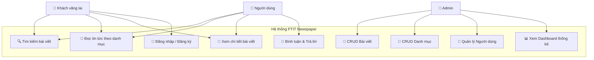
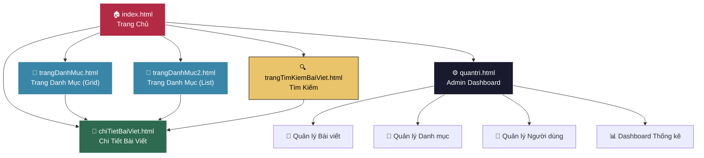
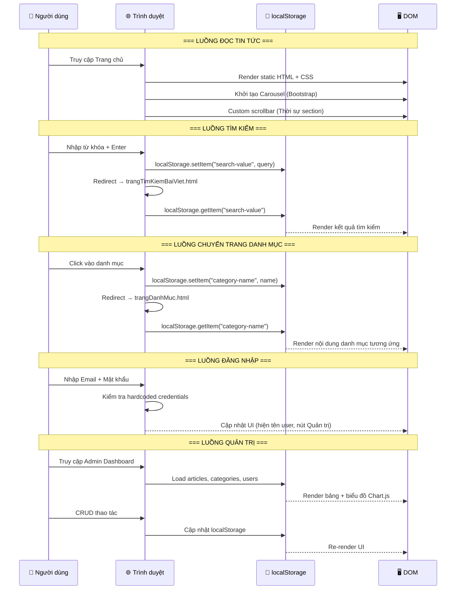
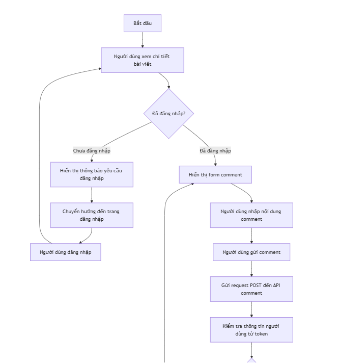
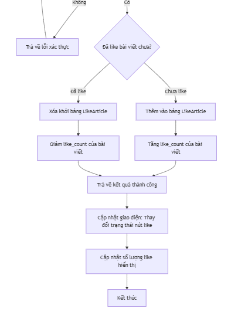
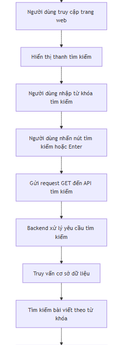
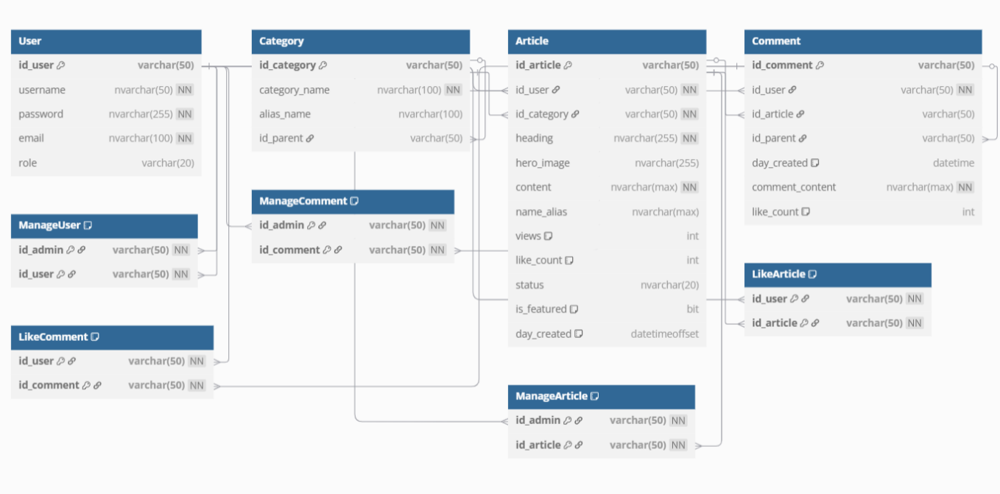
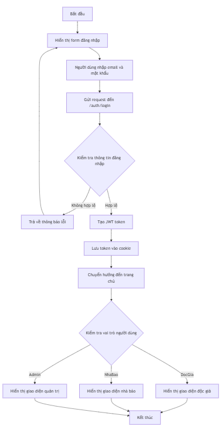
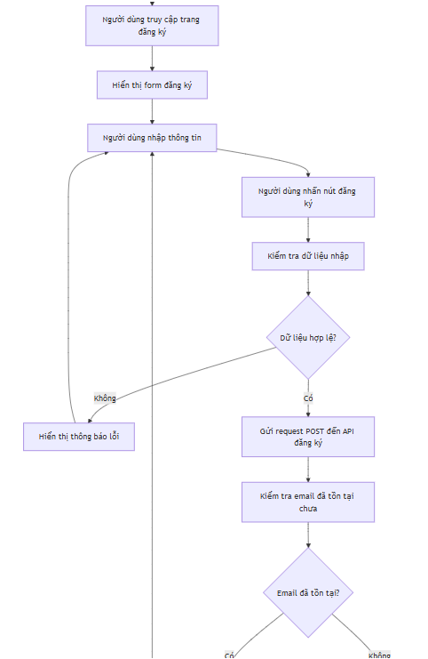

# 📰 PTIT Newspaper

### Trang Báo Điện Tử — Học viện Công nghệ Bưu chính Viễn thông


[](https://developer.mozilla.org/en-US/docs/Web/HTML)
[](https://developer.mozilla.org/en-US/docs/Web/CSS)
[](https://developer.mozilla.org/en-US/docs/Web/JavaScript)
[](https://getbootstrap.com/)
[](https://www.chartjs.org/)

🌐 **[Xem Demo Online](http://theptitnewspaper.kesug.com/)** &nbsp;|&nbsp; 🎨 **[Thiết kế Figma](https://www.figma.com/design/xucNIw1ZdVkL1Jo1APhKiJ/BTL_Web_Design?node-id=754-17&t=cbnL2WnRwkit4u1y-1)** &nbsp;|&nbsp; 📄 **[Báo cáo Final (PDF)](https://github.com/thanh12a2/PTIT-Newspaper/blob/main/B%C3%A1o%20c%C3%A1o%20final.pdf)**


---

## 📋 Mục lục

- [1. Giới thiệu dự án](#1-giới-thiệu-dự-án)
- [2. Phân tích nghiệp vụ (Business Analysis)](#2-phân-tích-nghiệp-vụ-business-analysis)
  - [2.1. Bài toán & Bối cảnh](#21-bài-toán--bối-cảnh)
  - [2.2. Đối tượng người dùng (User Personas)](#22-đối-tượng-người-dùng-user-personas)
  - [2.3. Sơ đồ Use-Case tổng quan](#23-sơ-đồ-use-case-tổng-quan)
  - [2.4. Hệ thống danh mục & phân cấp nội dung](#24-hệ-thống-danh-mục--phân-cấp-nội-dung)
- [3. Kiến trúc kỹ thuật (Technical Architecture)](#3-kiến-trúc-kỹ-thuật-technical-architecture)
  - [3.1. Công nghệ sử dụng](#31-công-nghệ-sử-dụng)
  - [3.2. Cấu trúc thư mục](#32-cấu-trúc-thư-mục)
  - [3.3. Sơ đồ Sitemap](#33-sơ-đồ-sitemap)
  - [3.4. Luồng dữ liệu (Data Flow)](#34-luồng-dữ-liệu-data-flow)
- [4. Tính năng chi tiết](#4-tính-năng-chi-tiết)
  - [4.1. Trang chủ (Homepage)](#41-trang-chủ-homepage)
  - [4.2. Trang danh mục (Category Page)](#42-trang-danh-mục-category-page)
  - [4.3. Trang chi tiết bài viết (Article Detail)](#43-trang-chi-tiết-bài-viết-article-detail)
  - [4.4. Trang tìm kiếm (Search Page)](#44-trang-tìm-kiếm-search-page)
  - [4.5. Trang quản trị (Admin Dashboard)](#45-trang-quản-trị-admin-dashboard)
  - [4.6. Hệ thống xác thực người dùng](#46-hệ-thống-xác-thực-người-dùng)
- [5. Hướng dẫn cài đặt & chạy dự án](#5-hướng-dẫn-cài-đặt--chạy-dự-án)
- [6. Tài liệu & Liên kết](#6-tài-liệu--liên-kết)


---

## 1. Giới thiệu dự án

**PTIT Newspaper** là một trang báo điện tử được xây dựng bằng **HTML, CSS & JavaScript thuần** (Vanilla), kết hợp **Bootstrap 5** và **Chart.js** — mô phỏng đầy đủ quy trình vận hành của một trang tin tức thực tế với các chuyên mục phong phú.

Dự án giải quyết bài toán xây dựng nền tảng đọc tin tức trực tuyến đa chuyên mục, đồng thời cung cấp **dashboard quản trị nội dung** cho admin với khả năng quản lý bài viết, danh mục và người dùng.

### ✨ Điểm nổi bật

| Tính năng | Mô tả |
|-----------|-------|
| 🏠 **Trang chủ đa section** | Carousel tin nổi bật, các section theo chuyên mục với layout đa dạng |
| 📂 **6 chuyên mục chính** | Xã hội, Khoa học & Công nghệ, Sức khỏe, Thể thao, Giải trí, Giáo dục |
| 🔍 **Tìm kiếm bài viết** | Tìm kiếm toàn trang theo tiêu đề, lưu trữ qua `localStorage` |
| 💬 **Hệ thống bình luận** | Đăng, trả lời, like bình luận — threaded comments |
| 🔐 **Đăng nhập / Đăng ký** | Modal popup xác thực, phân quyền Admin / User |
| ⚙️ **Admin Dashboard** | Quản lý CRUD bài viết, danh mục, người dùng + biểu đồ thống kê |
| 📱 **Responsive Navbar** | Sticky header, burger menu, dropdown danh mục đa cấp |

---

## 2. Phân tích nghiệp vụ (Business Analysis)

### 2.1. Bài toán & Bối cảnh

| Hạng mục | Chi tiết |
|----------|----------|
| **Lĩnh vực** | Truyền thông — Báo điện tử |
| **Bài toán** | Xây dựng website tin tức đa chuyên mục hỗ trợ quản trị nội dung |
| **Quy mô** | Frontend Static (Client-Side Rendering) với dữ liệu mô phỏng qua `localStorage` |
| **Mục tiêu** | Người đọc dễ dàng truy cập & tương tác; Admin quản lý nội dung hiệu quả |

### 2.2. Đối tượng người dùng (User Personas)

```
┌──────────────────┐     ┌──────────────────┐     ┌──────────────────┐
│   👤 Khách vãng   │     │  👤 Người dùng    │     │  👑 Quản trị viên │
│      lai          │     │  đã đăng nhập     │     │     (Admin)       │
├──────────────────┤     ├──────────────────┤     ├──────────────────┤
│ • Đọc tin tức    │     │ • Đọc tin tức    │     │ • Tất cả quyền   │
│ • Tìm kiếm      │     │ • Tìm kiếm      │     │   của User       │
│ • Xem danh mục  │     │ • Bình luận      │     │ • Quản lý bài    │
│ • Đăng ký       │     │ • Trả lời BL    │     │ • Quản lý DM     │
│                  │     │ • Like BL        │     │ • Quản lý user   │
│                  │     │                  │     │ • Xem thống kê   │
└──────────────────┘     └──────────────────┘     └──────────────────┘
```

### 2.3. Sơ đồ Use-Case tổng quan



### 2.4. Hệ thống danh mục & phân cấp nội dung

Hệ thống phân cấp **2 bậc** (Danh mục chính → Danh mục phụ):

```
📰 PTIT Newspaper
├── 🏛️ Xã hội
│   ├── Thời sự
│   ├── Giao thông
│   └── Môi trường - Khí hậu
│
├── 🔬 Khoa học & Công nghệ
│   ├── Tin tức công nghệ
│   ├── Hoạt động công nghệ
│   └── Tạp chí
│
├── 🏥 Sức khỏe
│   ├── Dinh dưỡng
│   ├── Làm đẹp
│   └── Y tế
│
├── ⚽ Thể thao
│   ├── Bóng đá
│   └── Bóng rổ
│
├── 🎬 Giải trí
│   ├── Âm nhạc
│   ├── Thời trang
│   └── Điện ảnh - Truyền hình
│
└── 📚 Giáo dục
    ├── Thi cử
    ├── Đào tạo
    └── Học bổng - Du học
```

> **Tổng cộng:** 6 danh mục chính + 17 danh mục phụ = **23 danh mục** được quản lý trong hệ thống.

---

## 3. Kiến trúc kỹ thuật (Technical Architecture)

### 3.1. Công nghệ sử dụng

| Layer | Công nghệ | Phiên bản | Vai trò |
|-------|-----------|-----------|---------|
| **Markup** | HTML5 | — | Cấu trúc semantic cho các trang |
| **Styling** | CSS3 (Vanilla) | — | 13 file CSS theo component & page |
| **Framework CSS** | Bootstrap | 5.3.3 | Grid system, carousel, responsive utilities |
| **Icons** | Bootstrap Icons | 1.11.3 | Bộ icon SVG cho UI |
| **Logic** | JavaScript (ES6+) | — | DOM manipulation, event handling, localStorage |
| **Charts** | Chart.js | Latest (CDN) | Biểu đồ thống kê cho Admin Dashboard |
| **Fonts** | Google Fonts | — | DM Serif Text, Open Sans, Roboto, Lexend Deca |
| **Data Store** | localStorage | — | Lưu trữ dữ liệu phía client (mô phỏng backend) |

### 3.2. Cấu trúc thư mục

```
PTIT-Newspaper-main/
│
├── 📄 index.html                          # Trang chủ (1,071 dòng)
├── 📄 README.md                           # Tài liệu dự án
├── 📄 Source.md                           # Google Fonts configuration
├── 📄 Báo cáo final.pdf                  # Báo cáo đồ án (PDF)
│
├── 📁 html/                               # Các trang con
│   ├── chiTietBaiViet.html               #   └── Chi tiết bài viết (499 dòng)
│   ├── trangDanhMuc.html                 #   └── Trang danh mục v1 (bố cục grid)
│   ├── trangDanhMuc2.html                #   └── Trang danh mục v2 (bố cục list)
│   ├── trangTimKiemBaiViet.html          #   └── Kết quả tìm kiếm
│   └── quantri.html                      #   └── Admin Dashboard (272 dòng)
│
├── 📁 css/                                # Stylesheets (13 files)
│   ├── globalScopeStyle.css              #   └── CSS reset & global variables
│   ├── navbar.css                        #   └── Header & navigation (~6.5KB)
│   ├── homePage.css                      #   └── Trang chủ layout (~19KB)
│   ├── styleTrangChu.css                 #   └── Trang chủ - section Tin nổi bật
│   ├── stylesTrangchuThoisu.css          #   └── Trang chủ - section Thời sự
│   ├── section3KhoaHocCongNghe.css       #   └── Trang chủ - section KH&CN
│   ├── giaoduc.css                       #   └── Trang chủ - section Giáo dục
│   ├── footer.css                        #   └── Footer component
│   ├── chiTietBaiVietStyle.css           #   └── Trang chi tiết bài viết (~8.5KB)
│   ├── trangDanhMuc.css                  #   └── Trang danh mục v1
│   ├── trangDanhMuc2.css                 #   └── Trang danh mục v2
│   ├── trangTimKiemBaiViet.css           #   └── Trang tìm kiếm
│   └── quantri.css                       #   └── Admin Dashboard
│
├── 📁 js/                                 # JavaScript (8 files)
│   ├── navbar.js                         #   └── Sticky header, auth, search (~7.5KB)
│   ├── homePage.js                       #   └── Carousel & fade animation (~5.3KB)
│   ├── scriptTrangchuThoisu.js           #   └── Custom scrollbar & hover effect (~9.8KB)
│   ├── pageWorkFlow.js                   #   └── Category routing & navigation (~2.3KB)
│   ├── chiTietBaiViet.js                 #   └── Comment system logic (~9.3KB)
│   ├── trangDanhMuc.js                   #   └── Dynamic category rendering (~9.6KB)
│   ├── trangTimKiem.js                   #   └── Search query handler
│   └── Quantri.js                        #   └── Admin CRUD operations (~25.5KB)
│
└── 📁 assets/                             # Tài nguyên media
    ├── 📁 trangChuImages/                #   └── Ảnh trang chủ (carousel, sections)
    ├── 📁 chiTietBaiVietImages/          #   └── Ảnh bài viết chi tiết
    ├── 📁 section3KhoaHocCongNgheImages/ #   └── Ảnh section KH&CN
    ├── 📁 trangDanhMucImages/            #   └── Ảnh trang danh mục v1
    ├── 📁 trangDanhMuc2Images/           #   └── Ảnh trang danh mục v2
    ├── 📁 trangDanhMucBackgroundImages/  #   └── Background theo category
    ├── 📁 timKiemBaiVietImages/          #   └── Ảnh trang tìm kiếm
    ├── 📁 img/                           #   └── Ảnh nội dung (sức khỏe, giáo dục...)
    ├── 📁 vectors/                       #   └── SVG/PNG icons (avatar, buttons)
    ├── navbarLogo.png                    #   └── Logo chính (~2.9MB)
    ├── navbarLogoSmall.png               #   └── Logo nhỏ (sticky header)
    └── navbarLine.png                    #   └── Divider line
```

### 3.3. Sơ đồ Sitemap



### 3.4. Luồng dữ liệu (Data Flow)



---

## 4. Tính năng chi tiết

### 4.1. Trang chủ (Homepage)

**File:** `index.html` (1,071 dòng) — Trang lớn nhất với nhiều section.

| Section | Mô tả | Kỹ thuật nổi bật |
|---------|--------|-------------------|
| **Header / Navbar** | Logo, search bar, user icon, dropdown danh mục đa cấp, burger menu | Sticky on scroll, CSS transitions |
| **Tin tức nổi bật** | 3 khối carousel (Big / Second / Third News) với text đồng bộ | Bootstrap Carousel + JS fade animation |
| **Thời sự — Xã hội** | Layout trái-phải: ảnh chính + danh sách tin với custom scrollbar | Custom drag scrollbar, hover preview |
| **Khoa học & Công nghệ** | Grid layout: bài viết trái + card listing phải | CSS Grid, transparent overlay |
| **Sức khỏe** | 2 bài viết lớn + 6 card nhỏ dạng slider | CSS Flexbox, hover flip effect |
| **Thể thao** | Hero image + sidebar 7 tin phụ trên nền đen | Dark theme section, absolute positioning |
| **Giải trí** | Grid 5 thẻ ảnh lớn/nhỏ xen kẽ | CSS Grid auto-fit, scale hover |
| **Giáo dục** | 1 bài lớn + 2 bài trung + 4 bài nhỏ | Responsive 3-column layout |
| **Footer** | Slogan, social links, bản quyền, tọa độ Google Maps | Bootstrap Icons, external link |

### 4.2. Trang danh mục (Category Page)

**Files:** `trangDanhMuc.html`, `trangDanhMuc2.html`

- **Dynamic Routing:** Nhận tên danh mục từ `localStorage`, tự động cập nhật heading, background và sub-categories.
- **Category Mapping:** Tự động nhận diện danh mục phụ → danh mục chính (switch-case logic).
- **Background thay đổi:** Mỗi danh mục có ảnh background riêng biệt (`trangDanhMucBackgroundImages/`).
- **2 layout:** Grid view (v1) và List view (v2).

### 4.3. Trang chi tiết bài viết (Article Detail)

**File:** `chiTietBaiViet.html` (499 dòng)

- **Hệ thống bình luận (Comment System):**
  - Đăng bình luận mới với avatar, tên, ngày giờ
  - Trả lời (reply) lồng nhau theo thread
  - Nút like với counter
  - Tự động ẩn + nút "Xem thêm" khi vượt 800px chiều cao
  
  
  

- **Scroll-to-top button**
- **Navbar & Footer** tái sử dụng cùng cấu trúc với trang chủ

### 4.4. Trang tìm kiếm (Search Page)

**File:** `trangTimKiemBaiViet.html`

Dưới đây là sơ đồ luồng hoạt động của tính năng Tìm kiếm:



- Nhận query từ `localStorage["search-value"]`
- Hiển thị kết quả dạng danh sách
- Hỗ trợ search từ cả search bar nhỏ (navbar) và search bar lớn (burger menu)

### 4.5. Trang quản trị (Admin Dashboard)

**File:** `quantri.html` + `Quantri.js` (726 dòng — file JS lớn nhất)

```
┌─────────────────────────────────────────────────────────┐
│  📊 DASHBOARD                                           │
│  ┌─────────────┐ ┌─────────────┐ ┌─────────────┐       │
│  │ 📝 Tổng      │ │ 📂 Tổng      │ │ 👤 Tổng      │     │
│  │ Bài viết: 3  │ │ Danh mục: 23│ │ Người dùng: 2│     │
│  └─────────────┘ └─────────────┘ └─────────────┘       │
│  ┌─────────────────────────────────────────────────┐    │
│  │          📈 Biểu đồ Bar Chart (Chart.js)        │    │
│  │     Thống kê số bài viết theo danh mục chính    │    │
│  └─────────────────────────────────────────────────┘    │
├─────────────────────────────────────────────────────────┤
│  MENU (Sidebar)                                         │
│  ├── 📝 Quản lý bài viết (CRUD + tìm kiếm + phân trang)│
│  ├── 📂 Quản lý danh mục (thêm/sửa/xóa danh mục 2 cấp)│
│  └── 👥 Quản lý người dùng (thêm/sửa/xóa + role)      │
└─────────────────────────────────────────────────────────┘
```

**Chức năng CRUD:**

| Module | Create | Read | Update | Delete | Tìm kiếm | Phân trang |
|--------|:------:|:----:|:------:|:------:|:---------:|:----------:|
| Bài viết | ✅ | ✅ | ✅ | ✅ | ✅ | ✅ |
| Danh mục | ✅ | ✅ | ✅ | ✅ | ✅ | ✅ |
| Người dùng | ✅ | ✅ | ✅ | ✅ | ✅ | ✅ |

**Mô hình dữ liệu (Data Model):**

### Mô hình dữ liệu (ERD)



### 4.6. Hệ thống xác thực người dùng

Dưới đây là sơ đồ luồng hoạt động (Flowchart) của quá trình Đăng nhập được trích xuất từ báo cáo:





**Lưu ý bảo mật (Demo):** Hệ thống hiện tại sử dụng credentials hardcoded phía client (`kiet@gmail.com / 123`) — phù hợp cho mục đích demo, **không** dùng cho production.

---

## 5. Hướng dẫn cài đặt & chạy dự án

### Yêu cầu

- Trình duyệt web hiện đại (Chrome, Firefox, Edge, Safari)
- Không cần cài đặt thêm bất kỳ dependency nào (pure frontend)

### Cách 1: Mở trực tiếp

```bash
# Clone repository
git clone https://github.com/thanh12a2/PTIT-Newspaper.git
cd PTIT-Newspaper

# Mở file trang chủ trong trình duyệt
# Windows
start index.html

# macOS
open index.html

# Linux
xdg-open index.html
```

### Cách 2: Sử dụng Local Server (Khuyến nghị)

```bash
# Sử dụng VS Code Live Server Extension
# 1. Cài VS Code extension "Live Server"
# 2. Click chuột phải vào index.html → "Open with Live Server"

# HOẶC sử dụng Python HTTP Server
cd PTIT-Newspaper-main
python -m http.server 8080
# Truy cập: http://localhost:8080

# HOẶC sử dụng Node.js
npx serve .
```

### Tài khoản Demo

| Role | Email | Mật khẩu |
|------|-------|----------|
| **Admin** | `kiet@gmail.com` | `123` |

> Đăng nhập bằng tài khoản Admin để thấy nút **"Quản trị"** trên navbar.

---

## 6. Tài liệu & Liên kết

| Tài liệu | Link |
|-----------|------|
| 🌐 **Website Preview** | [theptitnewspaper.kesug.com](http://theptitnewspaper.kesug.com/) |
| 📄 **Báo cáo Final (PDF)** | [Xem trên GitHub](https://github.com/thanh12a2/PTIT-Newspaper/blob/main/B%C3%A1o%20c%C3%A1o%20final.pdf) |
| 🎨 **Thiết kế UI/UX (Figma)** | [Mở Figma](https://www.figma.com/design/xucNIw1ZdVkL1Jo1APhKiJ/BTL_Web_Design?node-id=754-17&t=cbnL2WnRwkit4u1y-1) |
| 💻 **Source Code (GitHub)** | [github.com/trungng29/btl-web](https://github.com/trungng29/btl-web) |

---


